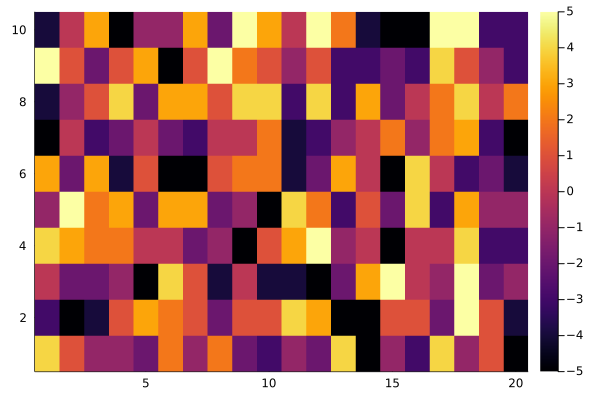
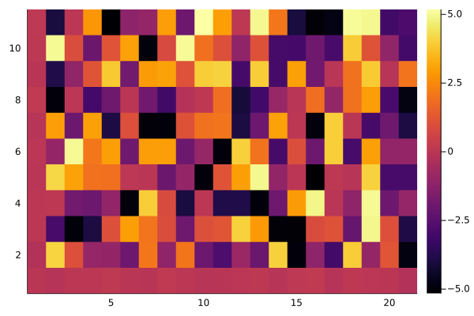
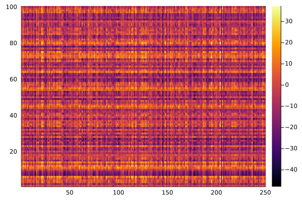

## Overview

The matrix linear model is a simple, yet flexible, multivariate framework. It encodes both categorical and continuous relationships to enhance detection of associations between responses and predictors.
For matrix linear model, let $Y$ be a $n \times m$ response matrix, the model can be expressed as: 

$$Y = XBZ^T+E$$

Where $X_{n \times p}$ is the matrix for main predictor,
$Z_{m \times q}$ denote the matrix from extra knowledge,
$E_{n \times m}$ is the error term, 
$B_{p \times q}$ is the matrix for main and interaction effects.


## Data Generation

First, construct a `RawData` object consisting of the response variable `Y` and row/column predictors `X` and `Z`. All three matrices must be passed in as 2-dimensional arrays. Note that the `contr` function can be used to set up treatment and/or sum contrasts for categorical variables stored in a DataFrame. By default, `contr` generates treatment contrasts for all specified categorical variables (`"treat"`). Other options include `"sum"` for sum contrasts, `"noint"` for treatment contrasts with no intercept, and `"sumnoint"` for sum contrasts with no intercept. 


```julia
using MatrixLM, DataFrames, Random, Plots, StatsModels
Random.seed!(1)

# Dimensions of matrices 
n = 100
m = 250

# Number of column covariates
q = 20

# Generate data with two categorical variables and 4 numerical variables.
X_df = hcat(DataFrame(catvar1=rand(1:5, n), catvar2=rand(["A", "B", "C"], n)), DataFrame(rand(n,4),:auto))

# Convert dataframe to predicton matrix
X = Matrix(contr(X_df, [:catvar1, :catvar2], ["treat", "sum"]))

p = size(X)[2]
```

Randomly generate some data for column covariates `Z` and response variable `Y`


```julia
Z = rand(m,q)
B = rand(-5:5,p,q)
E = randn(n,m)
Y = X*B*transpose(Z)+E
```


Finally, using all the data we have to construct a RawData object. The usage of `RawData()` can be found in here.


```julia
# Construct a RawData object
dat = RawData(Response(Y), Predictors(X, Z))
```

## Model construction

The matrix linear model could be build by using RawData object directly.

Least-squares estimates for matrix linear models can be obtained by running `mlm()`. An object of type `Mlm` will be returned, with variables for the coefficient estimates (`B`), the coefficient variance estimates (`varB`), and the estimated variance of the errors (`𝜎`). By default, `mlm` estimates both row and column main effects (`X` and `Z` intercepts), but this behavior can be suppressed by setting `hasXIntercept=false` and/or `hasZIntercept=false`. Column weights for `Y` and the target type for variance shrinkage can be optionally supplied to weights and targetType, respectively.


```julia
est = mlm(dat) # Model estimation
```


## Model prediction and residuals

The coefficient estimates can be accessed using `coef(est)`. Predicted values and residuals can be obtained by calling `predict()` and `resid()`. By default, both of these functions use the same data used to fit the model. However, a new `Predictors` object can be passed into `predict()` as the `newPredictors` argument and a new `RawData` object can be passed into `resid()` as the newData argument. For convenience, `fitted(est)` will return the fitted values by calling predict with the default arguments.


```julia
esti_coef = coef(est) # Get the coefficients of the model
```


```julia
preds = predict(est) # Prediction value
```


```julia
resids = resid(est) # Residuals
```


## T-statistics and permutation test

The t-statistics for an `Mlm` object (defined as `est.B ./ sqrt.(est.varB)`) can be obtained by running `t_stat`. By default, `t_stat` does not return the corresponding t-statistics for any main effects that were estimated by `mlm`, but they will be returned if `isMainEff=true`. 


```julia
tStats = t_stat(est)
```


    10×20 Matrix{Float64}:
      55.0593    15.5157    -13.7332  …  -13.4822   16.9667    -72.7102
     -43.2127   -85.3564    -61.2276      74.6016   15.8811    -63.506
       1.04613  -30.0836    -28.961       70.9267  -29.3495    -14.8734
      56.3955    48.2328     27.4123      56.6471  -42.5652    -44.6496
     -32.2053   185.189      68.339       99.0601  -35.7229    -35.7794
      96.4889   -75.9443    101.425   …  -99.4465  -68.6703   -141.992
     -64.0735     0.278908  -40.5377      39.4619  -40.0343    -68.9459
     -51.9953   -17.1299     15.8784      54.0004   -1.20985    29.7277
      66.1145    14.0632    -28.4093      15.099   -15.5784    -44.3614
     -54.151      0.125609   38.8427      68.1343  -44.1664    -41.4959


Permutation p-values for the t-statistics can be computed by the `mlm_perms` function. `mlm_perms` calls the more general function `perm_pvals` and will run the permutations in parallel when possible. The illustrative example below only runs 5 permutations, but a different number can be specified as the second argument. By default, the function used to permute `Y` is `shuffle_rows`, which shuffles the rows for `Y`. Alternative functions for permuting `Y`, such as `shuffle_cols`, can be passed into the argument `permFun`. `mlm_perms` calls `mlm` and `t_stat` , so the user is free to specify keyword arguments for `mlm` or `t_stat`; by default, `mlm_perms` will call both functions using their default behavior. 


```julia
nPerms = 5
tStats, pVals = mlm_perms(dat, nPerms)
```

After the modeling, we can compaire the difference between model estimation effect and the effect matrix that we generated.


```julia
heatmap(B)
```


    

    


```julia
heatmap(esti_coef)
```


    

    


```julia
heatmap(Y)
```


    

    


```julia
heatmap(X)
```


    
