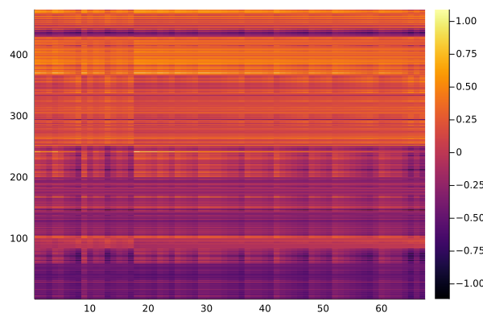
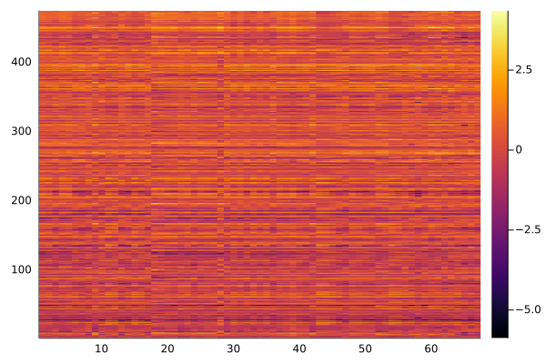
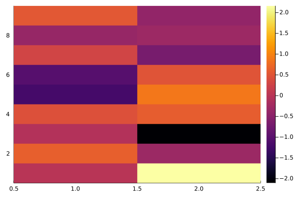

# Metabolomic signatures of NAFLD

Reference: Study ID ST001710

Background: Nonalcoholic fatty liver disease (NAFLD) is a progressive liver disease that is strongly associated with type 2 diabetes.  Accurate, non-invasive diagnostic tests to delineate the different stages: degree of steatosis, grade of nonalcoholic steatohepatitis (NASH) and stage fibrosis represent an unmet medical need. Here we report underlying associations between clinical data, lipidomic profiles, metabolic profiles and clinical outcomes, including downstream identification of potential biomarkers for various stages of the disease.


```julia
using StatsModels
using MatrixLM
using CSV
using DataFrames
using Random
using Plots
Random.seed!(1)
```


    TaskLocalRNG()


## Loading the data

The data was collected from [workbench](https://www.metabolomicsworkbench.org/data/DRCCMetadata.php?Mode=Study&DataMode=TreatmentData&StudyID=ST001710&StudyType=MS&ResultType=1#DataTabs). After initial data processing, there are three files would be involved in this Demonstration.


```julia
clinicalDF = CSV.read("ST001710_ClinicalCovariates.csv",DataFrame)
metabolitesTG = CSV.read("MetaboTG.csv",DataFrame)
refTG = CSV.read("refTriglycerides.csv",DataFrame)
```


<div class="data-frame"><p>67 rows × 5 columns</p><table class="data-frame"><thead><tr><th></th><th>metabolite_name</th><th>RefMetName</th><th>metabolite_ID</th><th>Total_C</th><th>Total_DB</th></tr><tr><th></th><th title="String31">String31</th><th title="String31">String31</th><th title="String15">String15</th><th title="Int64">Int64</th><th title="Int64">Int64</th></tr></thead><tbody><tr><th>1</th><td>TG(14:0/16:0/18:1)</td><td>TG 14:0_16:0_18:1</td><td>ME399158</td><td>48</td><td>1</td></tr><tr><th>2</th><td>TG(14:0/18:1/18:1)</td><td>TG 14:0_18:1_18:1</td><td>ME399159</td><td>50</td><td>2</td></tr><tr><th>3</th><td>TG(14:0/18:2/18:2)</td><td>TG 14:0_18:2_18:2</td><td>ME399160</td><td>50</td><td>4</td></tr><tr><th>4</th><td>TG(16:0/16:0/16:0)</td><td>TG 16:0_16:0_16:0</td><td>ME399161</td><td>48</td><td>0</td></tr><tr><th>5</th><td>TG(16:0/18:0/18:1)</td><td>TG 16:0_18:0_18:1</td><td>ME399162</td><td>52</td><td>1</td></tr><tr><th>6</th><td>TG(16:0/18:2/18:2)</td><td>TG 16:0_18:2_18:2</td><td>ME399163</td><td>52</td><td>4</td></tr><tr><th>7</th><td>TG(16:0/18:2/18:3)</td><td>TG 16:0_18:2_18:3</td><td>ME399164</td><td>52</td><td>5</td></tr><tr><th>8</th><td>TG(16:0/18:2/22:6)</td><td>TG 16:0_18:2_22:6</td><td>ME399165</td><td>56</td><td>8</td></tr><tr><th>9</th><td>TG(18:0/18:0/18:0)</td><td>TG 18:0/18:0/18:0</td><td>ME399167</td><td>54</td><td>0</td></tr><tr><th>10</th><td>TG(18:0/18:1/20:4)</td><td>TG 18:0_18:1_20:4</td><td>ME399168</td><td>56</td><td>5</td></tr><tr><th>11</th><td>TG(18:1/18:1/16:0)</td><td>TG(18:1/18:1/16:0)</td><td>ME399170</td><td>52</td><td>2</td></tr><tr><th>12</th><td>TG(18:1/18:1/18:1)</td><td>TG 18:1_18:1_18:1</td><td>ME399171</td><td>54</td><td>3</td></tr><tr><th>13</th><td>TG(18:1/18:1/22:6)</td><td>TG 18:1_18:1_22:6</td><td>ME399172</td><td>58</td><td>8</td></tr><tr><th>14</th><td>TG(18:1/18:2/18:2)</td><td>TG 18:1_18:2_18:2</td><td>ME399173</td><td>54</td><td>5</td></tr><tr><th>15</th><td>TG(18:2/18:1/16:0)</td><td>TG(18:2/18:1/16:0)</td><td>ME399174</td><td>52</td><td>3</td></tr><tr><th>16</th><td>TG(18:2/18:1/18:1)</td><td>TG(18:2/18:1/18:1)</td><td>ME399175</td><td>54</td><td>4</td></tr><tr><th>17</th><td>TG(18:2/22:5/16:0)</td><td>TG(18:2/22:5/16:0)</td><td>ME399177</td><td>56</td><td>7</td></tr><tr><th>18</th><td>TG(45:0)</td><td>TG 45:0</td><td>ME399178</td><td>45</td><td>0</td></tr><tr><th>19</th><td>TG(47:0)</td><td>TG 47:0</td><td>ME399179</td><td>47</td><td>0</td></tr><tr><th>20</th><td>TG(47:1)</td><td>TG 47:1</td><td>ME399180</td><td>47</td><td>1</td></tr><tr><th>21</th><td>TG(47:2)</td><td>TG 47:2</td><td>ME399181</td><td>47</td><td>2</td></tr><tr><th>22</th><td>TG(48:0)</td><td>TG 48:0</td><td>ME399182</td><td>48</td><td>0</td></tr><tr><th>23</th><td>TG(48:1)</td><td>TG 48:1</td><td>ME399183</td><td>48</td><td>1</td></tr><tr><th>24</th><td>TG(48:3)</td><td>TG 48:3</td><td>ME399184</td><td>48</td><td>3</td></tr><tr><th>25</th><td>TG(49:0)</td><td>TG 49:0</td><td>ME399228</td><td>49</td><td>0</td></tr><tr><th>26</th><td>TG(49:1)</td><td>TG 49:1</td><td>ME399185</td><td>49</td><td>1</td></tr><tr><th>27</th><td>TG(49:2)</td><td>TG 49:2</td><td>ME399186</td><td>49</td><td>2</td></tr><tr><th>28</th><td>TG(49:3)</td><td>TG 49:3</td><td>ME399187</td><td>49</td><td>3</td></tr><tr><th>29</th><td>TG(50:0)</td><td>TG 50:0</td><td>ME399188</td><td>50</td><td>0</td></tr><tr><th>30</th><td>TG(50:0).1</td><td>TG 50:0</td><td>ME399189</td><td>50</td><td>0</td></tr><tr><th>&vellip;</th><td>&vellip;</td><td>&vellip;</td><td>&vellip;</td><td>&vellip;</td><td>&vellip;</td></tr></tbody></table></div>


**Clinical Dictionnary:**    

-`T2DM` => type 2 diabetes mellitus (DummyCoding) 
-`Kleiner_Steatosis` => Stage of Non-Alcoholic Fatty Liver Disease (NAFLD)  (SeqDiffCoding)
-`NAS` => NAS score (NAFLD Activity Score) represents the sum of scores for steatosis, lobular -inflammation, and ballooning, and ranges from 0-8.   
-`Platelets_E10_9_per_L` => platelets count (10⁹/L)   
-`Liver_ALT` => alanine aminotransferase test (ALT) level   
-`Liver_AST` => aspartate aminotransferase test (AST) level   
-`AST_ALT_Ratio` => AST/ALT ratio  useful in medical diagnosis   


```julia
x = design_matrix(@mlmFormula(T2DM + Kleiner_Steatosis + Inflammation + 
        NAS + Platelets_E10_9_per_L + Liver_ALT + Liver_AST + AST_ALT_Ratio), clinicalDF, 
        [(:T2DM, DummyCoding()) , (:Kleiner_Steatosis , SeqDiffCoding())])

```


    473×9 Matrix{Float64}:
     0.0  -0.666667  -0.333333  1.0  2.0  208.0  100.0   46.0  0.46
     0.0  -0.666667  -0.333333  1.0  2.0  258.0   23.0   26.0  1.13043
     0.0  -0.666667  -0.333333  1.0  2.0  202.0   47.0   34.0  0.723404
     0.0  -0.666667  -0.333333  1.0  2.0  228.0   29.0   56.0  1.93103
     0.0  -0.666667  -0.333333  1.0  2.0  288.0  159.0   75.0  0.471698
     0.0  -0.666667  -0.333333  1.0  3.0  183.0  145.0  103.0  0.710345
     0.0  -0.666667  -0.333333  1.0  2.0  272.0   26.0   28.0  1.07692
     0.0  -0.666667  -0.333333  1.0  2.0  235.0   51.0   40.0  0.784314
     0.0  -0.666667  -0.333333  1.0  2.0  211.0   47.0   29.0  0.617021
     0.0  -0.666667  -0.333333  1.0  2.0  279.0   70.0   32.0  0.457143
     0.0  -0.666667  -0.333333  1.0  2.0  157.0   92.0   66.0  0.717391
     0.0  -0.666667  -0.333333  1.0  2.0  225.0   13.0   17.0  1.30769
     0.0  -0.666667  -0.333333  1.0  2.0  123.0   76.0   31.0  0.407895
     ⋮                                      ⋮                  
     1.0   0.333333  -0.333333  1.0  5.0  271.0  144.0   63.0  0.4375
     1.0   0.333333  -0.333333  2.0  6.0  207.0   33.0   34.0  1.0303
     1.0   0.333333  -0.333333  2.0  5.0  123.0   67.0   41.0  0.61194
     1.0   0.333333  -0.333333  2.0  6.0  303.0  101.0   70.0  0.693069
     1.0   0.333333  -0.333333  2.0  6.0  342.0   75.0   69.0  0.92
     1.0   0.333333  -0.333333  2.0  6.0  256.0   92.0   91.0  0.98913
     1.0   0.333333   0.666667  1.0  6.0  257.0   86.0   71.0  0.825581
     1.0   0.333333   0.666667  1.0  5.0  211.0  132.0   58.0  0.439394
     1.0   0.333333   0.666667  1.0  6.0  167.0   52.0   38.0  0.730769
     1.0   0.333333   0.666667  1.0  6.0  211.0  140.0   52.0  0.371429
     1.0   0.333333   0.666667  1.0  5.0  178.0   41.0   37.0  0.902439
     1.0   0.333333   0.666667  2.0  7.0  237.0  210.0  175.0  0.833333


```julia
z = design_matrix(@mlmFormula(Total_C + Total_DB), refTG, [])
```


    67×2 Matrix{Int64}:
     48  1
     50  2
     50  4
     48  0
     52  1
     52  4
     52  5
     56  8
     54  0
     56  5
     52  2
     54  3
     58  8
      ⋮  
     54  5
     54  6
     54  7
     55  5
     56  2
     56  3
     56  4
     56  4
     56  6
     56  9
     58  6
     58  9


```julia
y = Matrix(metabolitesTG)[:, 1:end .!= 1]
```


    473×67 Matrix{Any}:
      1.1915   1.1326   1.5057   0.8412  …   0.9862   0.9745   0.5205   1.0919
      0.7451   0.85     0.8767   0.5138      0.5019   0.7342   1.3283   0.7389
     -1.7341  -2.0946  -1.9687  -1.7667     -1.6835  -0.7093  -0.8444  -0.9356
     -0.7785  -0.5572  -0.4555  -0.8782     -0.7025  -1.9648  -1.7372  -1.4091
      1.022    1.1019   0.2831   0.8649      0.6841  -0.3052  -0.0702  -0.3046
     -0.2031  -0.5678   0.1707  -0.1022  …  -1.8611  -2.2335  -1.4394  -1.6507
      0.4625  -0.0264   0.7786   0.538      -0.1839   0.2296   0.7975   0.2989
      1.7265   1.4175   0.8062   1.6807     -0.3621  -3.9294  -0.7314  -1.4759
     -1.9757  -1.757   -1.661   -2.2249     -0.6893  -1.0371  -1.4124  -1.5436
     -1.4767  -1.2936  -0.2674  -1.9855      0.297   -0.0945   0.3965   0.1923
     -0.582    0.0035   0.1003  -1.0773  …   0.4682   0.6303   0.9752   0.629
     -0.8704  -1.145   -0.7352  -1.1455     -0.6745  -0.3156  -0.6103  -0.315
     -0.0252  -0.5357   0.5579  -0.4        -1.0958   0.0316  -0.1104   0.0239
      ⋮                                  ⋱                     ⋮       
      0.4254   0.1893   0.1025   0.418       0.4699   0.2711   0.5424   0.3807
      1.2171   1.1844   1.3514   1.4716      0.7592   0.676    0.2554   0.7445
      1.1051   0.8078   0.6913   0.8754      0.7098   0.5772   0.7718   0.469
      0.883    0.71     0.2496   1.007      -0.4016  -0.1466   0.1825  -0.3208
      1.0853   0.7247   1.2291   1.2855  …  -0.114    1.0124   1.2947   1.0537
      0.5859   0.7458   0.2552   0.5755      0.9215   0.559    0.6726   0.6344
      1.0546   0.7675   0.6454   1.3392      0.504    0.6178   0.9394   0.6517
      0.5454   0.4485   0.8493   0.564       0.4447   1.027    1.0916   1.1414
      0.893    0.5895   0.7211   1.1027     -0.6625   0.1322  -0.0763   0.069
      1.1957   1.0409   1.4728   1.6534  …  -0.0835   1.0067   1.2082   1.1858
     -0.1423  -0.1936   0.0728  -0.3477      0.0643  -0.0617   0.1463  -0.2215
      0.6841   0.8498   0.1151   1.2461     -0.6734   0.0452   0.2134   0.1169


```julia
size(y)
```


    (473, 67)


```julia
size(x)
```


    (473, 9)


```julia
size(z)
```


    (2, 67)


```julia
dat = RawData(Response(y), Predictors(x, z))
```


    RawData(Response([1.1915 1.1326 … 0.5205 1.0919; 0.7451 0.85 … 1.3283 0.7389; … ; -0.1423 -0.1936 … 0.1463 -0.2215; 0.6841 0.8498 … 0.2134 0.1169]), Predictors([0.0 -0.6666666666666666 … 46.0 0.46; 0.0 -0.6666666666666666 … 26.0 1.1304347826087; … ; 1.0 0.3333333333333333 … 37.0 0.902439024390244; 1.0 0.3333333333333333 … 175.0 0.833333333333333], [48.0 1.0; 50.0 2.0; … ; 58.0 6.0; 58.0 9.0], false, false), 473, 67, 9, 2)


```julia
est = mlm(dat)
```


    Mlm([-1.8339105680518992 0.024010300529453556 -0.047274625209394155; 0.3224962221633218 1.2658490372934343e-5 0.026927685072659694; … ; 0.0018466689395890904 -0.00011691351178802451 -0.00014810848037966087; -0.3161947409443545 0.008094863064259777 -0.00936715843158992], [1.1526393739174525 0.0004381951780666892 0.0009918278802080206; 0.17999064115867314 6.842645916632619e-5 0.00015487908891308983; … ; 0.00026624486241180197 1.0121744713384742e-7 2.2909947679879038e-7; 0.585448109387619 0.000222567911826589 0.0005037688026674165], [0.9702370254938193 0.8965862589761437 … 0.45812014791627675 0.32091632605532067; 0.8965862589761437 0.9517252689434247 … 0.5229448769229895 0.382015487592257; … ; 0.45812014791627675 0.5229448769229895 … 0.9403454043909194 0.7322590567742504; 0.32091632605532067 0.382015487592257 … 0.7322590567742504 0.8630770359757838], RawData(Response([1.1915 1.1326 … 0.5205 1.0919; 0.7451 0.85 … 1.3283 0.7389; … ; -0.1423 -0.1936 … 0.1463 -0.2215; 0.6841 0.8498 … 0.2134 0.1169]), Predictors([1.0 0.0 … 46.0 0.46; 1.0 0.0 … 26.0 1.1304347826087; … ; 1.0 1.0 … 37.0 0.902439024390244; 1.0 1.0 … 175.0 0.833333333333333], [1.0 48.0 1.0; 1.0 50.0 2.0; … ; 1.0 58.0 6.0; 1.0 58.0 9.0], true, true), 473, 67, 10, 3), nothing, nothing, 0.0)


```julia
esti_coef = coef(est)
```


    10×3 Matrix{Float64}:
     -1.83391       0.0240103    -0.0472746
      0.322496      1.26585e-5    0.0269277
     -0.506297      0.00729462   -0.00545668
      0.115342     -0.00067627   -0.0341738
     -0.517741      0.00451345    0.00913054
      0.516405     -0.00687091    0.00748728
      1.87527e-5   -3.48344e-7    2.4996e-7
      0.000929579   5.69564e-5   -0.000211403
      0.00184667   -0.000116914  -0.000148108
     -0.316195      0.00809486   -0.00936716


```julia
preds = predict(est)
heatmap(preds.Y)
```


    

    


```julia
heatmap(y)
```


    

    


```julia
tStats = t_stat(est)
```


    9×2 Matrix{Float64}:
      0.00153028   2.16373
      0.628741    -0.312618
     -0.0626589   -2.10461
      0.448017     0.602418
     -1.21914      0.88304
     -1.04636      0.49907
      0.283334    -0.69901
     -0.367483    -0.309434
      0.542598    -0.417342


```julia
nPerms = 5
tStats, pVals = mlm_perms(dat, nPerms)
```


    ([0.0015302764049054138 2.1637278091714887; 0.6287410927392904 -0.31261761171712044; … ; -0.36748279939724654 -0.3094338902191314; 0.5425980527698667 -0.4173421328566651], [1.0 0.0; 0.6000000000000001 1.0; … ; 1.0 0.8; 0.8 0.8])


```julia
heatmap(tStats)
```


    

    


```julia
pVals
```


    9×2 Matrix{Float64}:
     1.0  0.0
     0.6  1.0
     1.0  0.0
     0.8  0.4
     0.0  0.2
     0.4  0.6
     1.0  0.2
     1.0  0.8
     0.8  0.8


```julia

```
