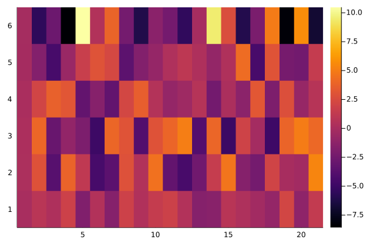
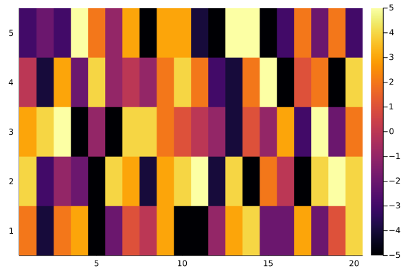

## Modelling ordinal data 

For this part our X matrix has only one ordinal variable(catvar1) from 1 to 5. The encoding method for ordinal variable is `SeqDiffCoding()` from package `StatsModels`


```julia
using StatsModels
```


```julia
levels = unique(X_df.catvar1)
encoding = StatsModels.ContrastsMatrix(SeqDiffCoding(), levels).matrix
encoding_intercept = inv(hcat(ones(5,1),encoding))
X2 = reduce(vcat,transpose.(map(x -> encoding_intercept[x,:], X_df.catvar1)))
```


```julia
p = size(X2)[2]
n = 100
m = 250
q = 20
```


```julia
# Number of column covariates
Z2 = rand(m,q)
B2 = rand(-5:5,p,q)
E2 = randn(n,m)
Y2 = X2*B2*transpose(Z2)+E2
```


```julia
dat2 = RawData(Response(Y2), Predictors(X2, Z2))
```


```julia
est2 = mlm(dat2)
```


```julia
heatmap(coef(est2))
```


    

    


```julia
heatmap(B2)
```


    
