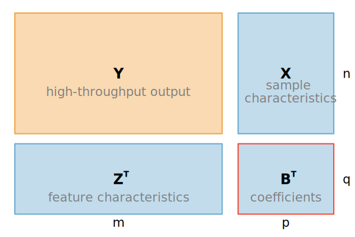

# Summary

`MatrixLM` is an open-source Julia package for fitting matrix linear
models, which extend classical linear regression to a bilinear
framework for matrix-valued responses.  It is designed for analyzing
high-throughput assays in which both rows and columns of the
data matrix have associated covariates, such as in metabolomics,
proteomics, or chemical genetic screens.

In a matrix linear model, the entries of a response matrix are modeled
as a joint function of sample-level covariates (e.g., treatment group,
demographic factors) and feature-level covariates (e.g., molecular or
anatomical annotations, biological groups, pathways). `MatrixLM`
implements efficient estimation and inference for this class of models
using efficient matrix operations whenever possible
allowing users to fit large numbers of models while retaining an
explicit linear model interpretation. The inputs include a response
matrix and two design matrices encoding the row and column covariates,
and the main outputs include estimated coefficients, standard errors,
and test statistics for user-specified contrasts.

Compared with workflows built from many separate univariate models,
`MatrixLM` provides a unified interface for specifying, fitting, and
summarizing matrix linear models. This reduces code duplication,
improves reproducibility, and makes it easier to express hypotheses
that naturally involve both sample- and feature-level information (for
example, testing for differential effects across feature groups or
experimental conditions). By providing an efficient implementation in
Julia, `MatrixLM` enables researchers to perform interpretable
analyses of large structured matrix-valued data.

# Statement of need

High-throughput studies in biology and medicine often produce
matrix-shaped data where each row corresponds to a sample (e.g., a
patient, mutant strain, or experimental unit) and each column
represents a molecular measurement (e.g., metabolite, gene, or
phenotype). In many applications, both the samples and the measured
features have associated metadata that should be incorporated into the
analysis. However, existing tools either ignore these annotations or
handle them in a fragmented, two-step fashion.

Standard approaches often involve fitting a separate model to each
feature (e.g., using t-tests or linear models) and then performing a
second-stage enrichment or grouping analysis. This approach is limited
in two key ways: (1) it does not handle overlapping or quantitative
annotations well, and (2) it fails to exploit shared structure among
features or among samples. Dimension-reduction and machine learning
methods address some of these issues, but often sacrifice
interpretability and do not provide familiar statistical outputs like
effect sizes or confidence intervals.

MatrixLM addresses this gap by implementing matrix linear models
(MLMs), a class of bilinear models that allow researchers to directly
model associations between sample-level and feature-level
characteristics. MLMs naturally accommodate both categorical and
continuous annotations, support hypothesis testing, and enable users
to assess the effect of covariates while adjusting for confounding
structure. Compared to standard univariate workflows, MLMs offer
better interpretability and power, especially when annotations overlap
or when feature relationships are complex, as demonstrated in both
chemical genetic screens [@liang_matrix_2019] and metabolomics
applications [@farage_metabolomics_2025].

Despite their utility, matrix linear models have not been widely
available in reusable, general-purpose software. MatrixLM provides a
fast, open-source Julia implementation with a user-friendly formula
interface, making it easier for applied researchers to fit, interpret,
and extend these models in large-scale studies.

# Key Features

`MatrixLM` leverages the speed and expressiveness of the Julia
programming language to provide:

* **Closed-form Estimation:** Uses efficient matrix operations to
solve least squares problems without the need for iterative solvers or
massive Kronecker products in memory.
* **Formula Interface:** Includes a `@formula` macro that allows users
to specify models for both row ($X$) and column ($Z$) covariates using
standard statistical model formula syntax (e.g., `~ Treatment + Age`).
* **Statistical Inference:** Provides standard errors, t-statistics,
and p-values for estimated coefficients.
* **Permutation Testing:** Built-in support for permutation tests to
control false positive rates making minimal assumptions about the
error distribution.

# Mathematical framework

Matrix linear models extend ordinary linear regression to situations
where the outcome is a whole matrix rather than a single response
vector. We arrange the data as follows:

- $Y$ is an $n \times m$ matrix of high-throughput measurements (rows
  = samples, columns = features).
- $X$ is an $n \times p$ matrix of sample-level covariates (e.g.,
  treatment group, sex, clinical variables).
- $Z$ is an $m \times q$ matrix of feature-level covariates (e.g.,
  metabolite class, pathway, or other annotations).
- $B$ is a $p \times q$ matrix of regression coefficients linking the
  sample and feature covariates.

The matrix linear model assumes $$ Y = X B Z^T + E, $$ where $E$ is an
$n \times m$ matrix of residuals. In element-wise form, each entry
$y_{ij}$ is written as $$ y_{ij} = \sum_{k=1}^p \sum_{\ell=1}^q
x_{ik}\, z_{j\ell}\, b_{k\ell} + e_{ij}.  $$
As the equation above shows, the elements of $B$ may be interpreted
as interactions between the columns of $X$ and the columns of $Z$.

We treat $X$ and $Z$ as known and estimate $B$ by least squares,
choosing $\hat B$ to minimize the Frobenius norm of the residuals,
$$
\hat B = \arg\min_B \,\| Y - X B Z^T \|_F^2.
$$
This optimization problem has a closed-form solution:
$$
\hat B = (X^T X)^{-1} X^T Y Z \,(Z^T Z)^{-1},
$$
when $X^T X$ and $Z^T Z$ are invertible. From $\hat B$, the software
can construct fitted values $ \hat Y = X \hat B Z^T $ and standard
errors and test statistics for entries of $\hat B$ or for
user-specified linear contrasts, directly analogous to classical
linear models.

When there is only a single feature (one column of $Y$) and no
feature-level design matrix $Z$, this framework reduces to ordinary
linear regression with design matrix $X$.  The `MatrixLM` package
therefore generalizes familiar linear modeling ideas to matrix-valued
outcomes with structured annotations on both rows and columns.

# Figures

A visualization of the response ($\mathbf{Y}:n \times m$), sample covariates
($\mathbf{X}:n \times p$), feature covariates ($\mathbf{Z}:m
\times q$), and coefficients ($\mathbf{B}:p \times q$) matrices for a
matrix linear model. The dimensions in the model correspond to $n$
samples/individuals, $m$ features/measurements, $p$ sample covariates, and $q$ feature covariates; the
matrix $\mathbf{B}$ is to be estimated.

# Conclusion and future directions

`MatrixLM` provides a practical implementation of matrix linear models
for encoding relationships and groupings high-throughput,
matrix-shaped data with annotations on both samples and features. By
combining a flexible formula interface with fast, closed-form
least-squares estimation, the package makes it straightforward for
applied researchers to encode biological or experimental structure
directly into their models.

In ongoing work, we are extending this framework to penalized matrix
linear models for high-dimensional settings: a companion Julia
package, `MatrixLMnet`, that implements elastic-net and related
penalties on the coefficient matrix to enable variable selection and
regularization in matrix linear models.

# Acknowledgements

This work started when JWL was a summer intern at UCSF, and continued
when she was a scientific programmer at the University of Tennessee
Health Science Center (UTHSC). We thank both UCSF and UTHSC for
funding, and a supportive environment. This work was partly supported
by National Institutes of Health grants GM-070683 (SS), GM-078338
(SS), GM-123489 (SS, GF), ES-022841 (SS), and DA-044223 (SS).

# References
